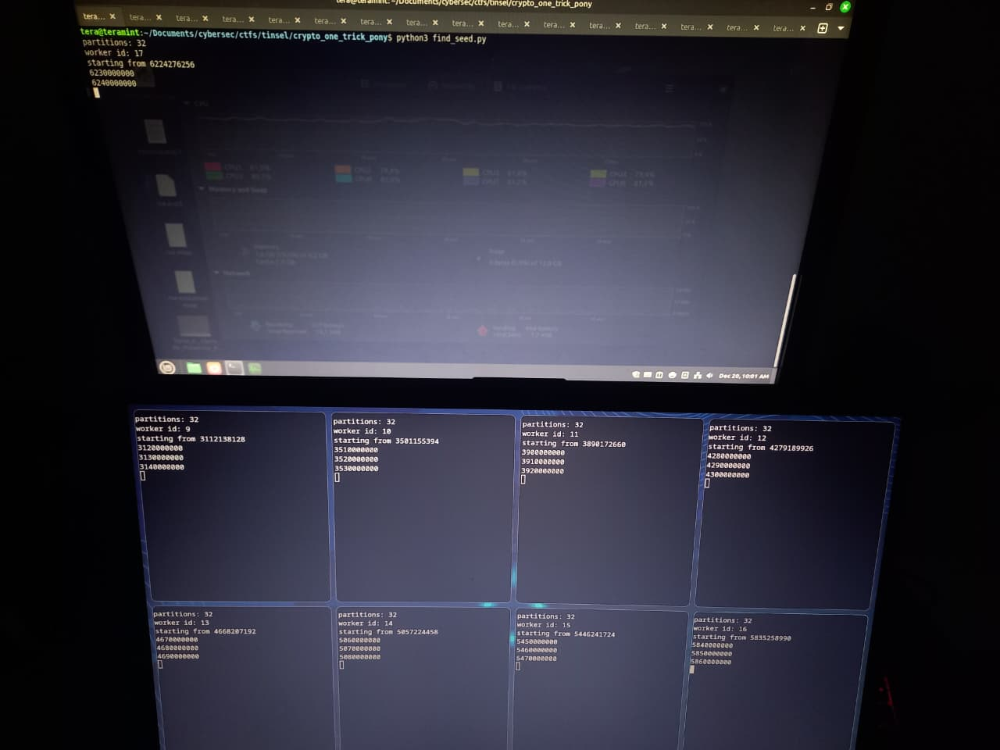
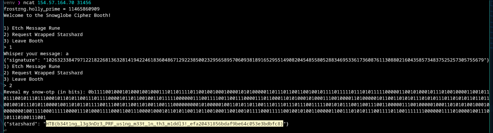

one trick pony - writeup
===

Fernando González

# part 1: understanding

we're given a single python code which is the one that'll run when we netcat into it. it does the following:

1. asserts that `len(FLAG.strip("HTB{}")) == 79`. this means `len(FLAG) == 84` (had to be careful cuz `flag.txt` cannot have newlines)
1. defines a pseudorandom function that generates bits based on the Legendre symbol of an ever-increasing random seed, modulo a 34 bit random prime $p_{RNG}$. pretty much like Damgård tells us in [1]. this PRF has a function to generate n of those bits
1. assigns a 259 bit **fixed** `PRIME`
1. defines a function to sign a message: it hashes it, passes it to an int mod `PRIME` ($h$), gets 500 bits from the PRF $e$, then calculates $h^e \text{ mod PRIME}$
1. then it defines the menu logic: it first prints the random prime the PRF is using. then we have 2 functions: sign a message or verify an OTP. this OTP is `len(FLAG)*8 == 672` bits long taken from the PRF, and we have to send the bit sequence that matches it perfectly.
1. there's also a limit of up to 2000 sign operations we can do before the program auto terminating

# part 2: observations

1. we can gather up to `1999*500` bits of encoded Legendre sequences
1. apparently this Legendre PRF is considered computationally secure
1. the Legendre sequence has the entire prime as period, no way to have less
1. the PRF skips 0, which is the only number with Legendre symbol 0. even then we wouldn't notice because it'd just output the same bit as the ones who have symbol -1
1. $p_{RNG} = 2^{34} \approx 1,7 \times 10^{10}$ is big, but not that big...........
1. $\text{PRIME} - 1$ is smooth, many small factors (!!!)

# part 3: getting there

as soon as i found out that $p-1$ is smooth for a prime modulus associated with exponentiation, i went ahead and tried out factorizing with Pohlig-Hellman with sagemath. i married with a single message as input ("a") to have a fixed base $g$. then:

```py
Fp = GF(p)
g = Fp(g)   # hash

# smooth!!!
factors = factor(p - 1)

y = Fp(y)   # my signature
# Pohlig–Hellman
x = discrete_log(y, g, ord=p-1)
```

and like magic, i could gather the Legendre sequence for that specific message. however, something tragic is there doesn't seem to be some sort of inverse function that takes that sequence and gives me where it starts. also there's no clear transition between L(x) and L(x+1). 

after much doubting i resorted to making a direct bruteforce of that sequence. first i tried making a checker that, for each seed, checks if the next 500 bits of consecutive "Legendre bits" and are the same to the ones of the given $x$.

after some thinking i realized i could just hold a "sliding window", and for each seed update it through a shift and bitmask. then i could check if that number matches exactly with an xor! that's nice

[**python code**](https://pastebin.com/Uxdyd3Gm)

# part 4: deranged behavior

so this code has a $O(p \, log(p))$ complexity. for $p \approx 2^{34}$ that's very big, but feasible. on friday i tried on only my laptop, but measured that it could take me up to 24 hours to get the answer. that's problematic because i needed to be connected to the socket throughout, and after some hours it'd disconnect

at night it dawned on me i could paralellize, so next morning i took 3 computers and ran different segments of the checker. it was a true hackerman experience

{ width=50% }

even then, the amount of time to complete it would be around 3 hours, and i'd often fail on the steps. i was about to give up, but then wondered to translate the code to C++. normally i wouldn't do this because python is really comfortable to work with big numbers. but i could install and use the library `boost/multiprecision/cpp_int.hpp`, which then made it very comfortable to use. i also compiled it with optimization flags

[**c++ code**](https://pastebin.com/xgL1nUMA)

i wasn't very hopeful it'd change the time that much, because the asymptotic complexity was already heavy, but oh my days. when 10 million numbers would take me around 2 minutes on the python code, now took me around 5 seconds. this truly changed the game and i could even do it with only my computer!!

i obtained the seed and, with it, simulated the server with that prime and seed to get the OTP in binary form that it'd generate. i pasted this bit string in the remote prompt and...



pawsome!

p.s: the flag mentioned something about using meet in the middle. Laaksonen [2] tells us in his competitive programming book:

> Meet in the middle is a technique where the search space is divided into two parts of about equal size. A separate search is performed for both of the parts, and finally the results of the searches are combined.

i'm interested to know what could've been done to further reduce the time complexity with a technique like this

# references

[1] https://link.springer.com/chapter/10.1007/0-387-34799-2_13  
[2] https://cses.fi/book/book.pdf