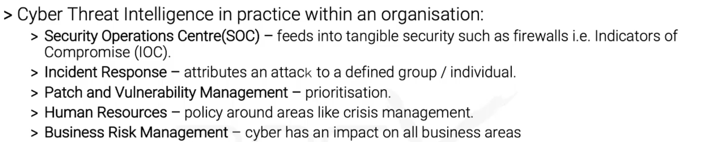
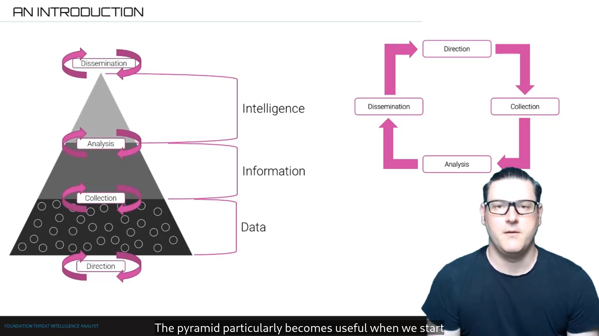
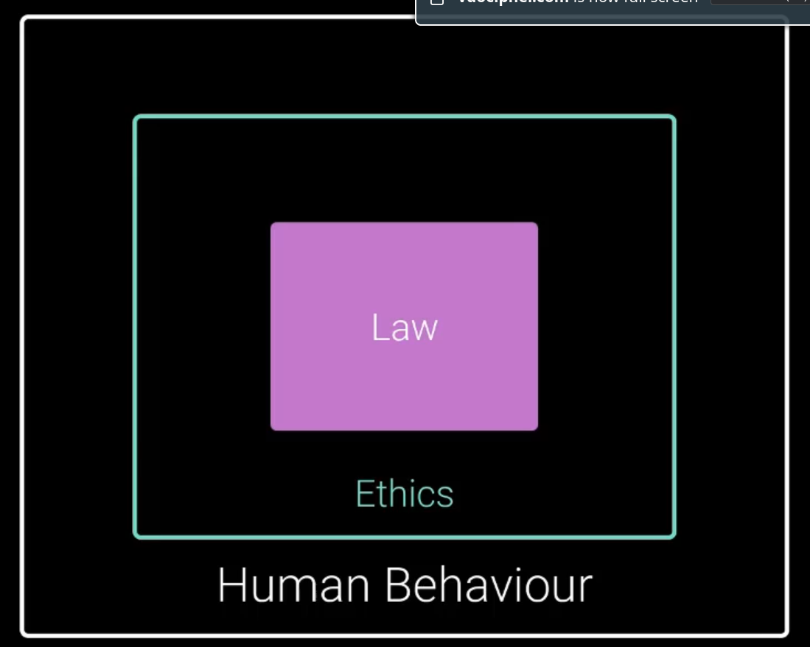
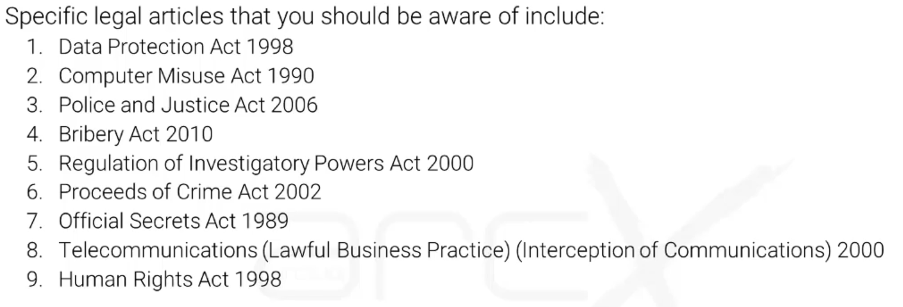

ArcX CTI 101
===

# objectives of threat intelligence

>  Cyber threat intelligence (CTI) is the gathering of information from various sources about current or potential threats to an organisation. 

Many different things for many different people:

* Indicators of Compromise?
* Reporting?
* Analysis of the structure of threats?

Cybersecurity is about the idea of **Attacker vs Defender**
* nearly always about defense?

CTI: we advise what are the best defences against the attacker. we help go to the speed of the threat
* we could choose random defences
* or actually have a structure to find good defences

CTI is fundamentally about interactions with people
* studying even the psychology of people through technological traces

CTI is fundamentally a structured analysis of the threat
* an art, a craft (tools?), a science
* usually sits inside cybersec, it's one "organ" of it
* we interact with IR and viceversa
* interaction with SOC
* cybersec sits in a wider business

## what is in a name?

* cyber: widespread interconnected digital network, not just internet!
	- a crossover between device <-> mind
	- surface, deep, dark web
* threat: an entity with the ability to inflict damage
* intelligence: insight an org uses to understand threats
	- to mitigate harm
	- data -> information -> intelligence
	- data -> info through collection
	- info -> intel through analysis
	
## how orgs use CTI

* threat landscape
* context
* threats are ever-evolving, fear of extinction level events
* networks are becoming larger and more diffuse

business processes:

* strategic level: 'board', decision makers (CISO)
* operational level: SOC operations
* tactical level: threat hunting

we provide *different intelligence* to *different levels*

optimize actionability: intelligence that a decision maker can take action on

## the role of CTI

moving data -> info -> intel

recommended book: Psychology of Intelligence Analyst

# intro to threat actors

hack: concept born in 1955. not always bad

* black
* grey: doesn't ask for consent but stops if activities become malicious
* white

black hat types:

* nation states (APT)
* cybercriminals
* hacktivists

differentiators:

* motivation: why you do what you do?
* capability: how far can they get?
* intent: which parts of the CIA triad do they mean to attack? what counts as "winning" for them

# threat vectors

a path through which an attacker gains access to a victim

vuln: flaw in a system/org

apply security controls: countermeasures to prevent, reduce or counteract risks

* isolating legacy
* training
* physical security (e.g. no USBs)

attack surface: sum of points in an org that can be used to mount an attack

vectors:

* email: interesting: unsubscribe button can be effective for phishing!
* users: exploited directly or indirectly
	- spear phishing
	- watering hole attack: attackers compromise something and just wait for someone to eventually activate their malware
	- insiders
* VPNs or RDP
* software
* network

vectors:

* don't exist in isolation
* potentially infinite ways to exploit

* supply chain vulnerabilities: what if something was compromised before you had even bought it?

# activities

## 1: stuxnet

seemed to be targeted to Iran nuclear infrastructure (plants & reactors) that used a specific Siemens product. but it proliferated

## 2: APT1

close ties with chinese gov

infect businesses, exfiltrate over months even years, use as hops for C2

C2: WEBC2 + HTRAN. they would use websites with special HTML tags/comments to send instructions to the infected machine. the machine would constantly listen to that website (firewalls usually prevent inbound but not outbound)

UglyGorilla, DOTA, SuperHard

# 3: solarwinds hack

https://www.techtarget.com/whatis/feature/SolarWinds-hack-explained-Everything-you-need-to-know

https://nvd.nist.gov/vuln/detail/CVE-2020-10148

Orion: software for IT monitoring, observability, etc. uses privileged permissions

* 30000+ orgs, including gov+federal agencies used Orion, the affected system
* SolarWinds inadvertedly delivered malware as an update to Orion
* amount of victims could grow from there based on the nature of Orion
* they compromised a SolarWinds official signature!!

SUNBURST: malware used to insert SUNBURST backdoor

SURBURST: the actual backdoor, uses HTTP to interact with remote servers

* Sep 2019: initial access to SolarWinds net
* Feb 2020: Sunburst (first code) injected into Orion
* Mar 2020: SolarWinds starts sending malware updates

threat actors: Nobelium aka Solorigate

# the intelligence cycle

1. direction: intel team takes direction from the customer
2. collection: collect data and turn it into info
3. analysis: turn it into intelligence
4. dissemination: intelligence handed back to the client, stimulates new **direction**
5. loop ^

why this is important:

* make managers understand progress

sterile corridor: deliberate separation between phases of the cycle, so that each phase can be treated as a black box

* also used to e.g. protect identities of data sources in the collection phase

# law and ethics

* CTI is not regulated per-se, but there are items that can be applied to it

* law: rules & regulations, not to break
* ethics: guidelines, what should be followed

example: legal but unethical

ambiguity in CTI:

* data breaches
* if you find problematic news for another company: responsible disclosure vs ambulance chasing (using it for advantage)

# recommendations to check

hacker groups:

* Phineas Fisher
* mandiant APT1 report
* Fancy Bear
* the cult of the dead cow
* FIN7, Carbanak, REvil

recommended book: Psychology of Intelligence Analyst

recommended book: The Art of Deception

ZNet