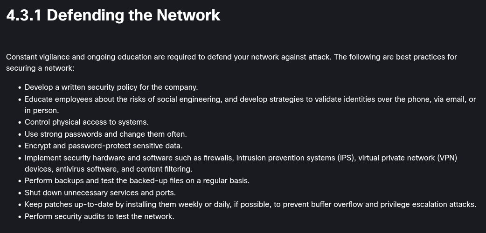

endpoint security
===

# threats, vulns and attacks

threat domain: an area that attackers can exploit

* software attacks
* software errors
* sabotage
* human error
* theft
* hardware failures
* outages
* natural disasters

internal & external threats

user domain, can be breached through:

* no awareness of security
* badly enforced policies
* data theft
* unauthorized downloads and devices
* unauthorized vpns
* unauthorized websites
* destruction of things

threats to:

* devices
* the LAN
* the private cloud
* the public cloud
* applications

threat complexity: APTs and algorithm attacks

backdoors & rootkits

research sources: dark web, indicators of compromise, automated indicator sharing

## social engineering

pretexting, quid pro quo, identity fraud

threats through: 

* authority
* intimidation
* consensus
* scarcity
* urgency
* familiarity
* trust

attacks:

* shoulder surfing
* dumpster diving
* impersonation
* hoaxes (fearmongering & ragebaiting)
* piggybacking / tailgating
* invoice scams
* watering hold attack
* typosquatting (claiming typoed website domains)
* prepending (removing the 'external organization' email warning)
* influence campaigns

* phishing, **spear** phishing, whaling
* scareware

## cyber attacks

* viruses
* worms
* trojans
* logic bombs: program that waits for a trigger
* ransomware
* DoS

dns attacks:
* dns servers' reputation
* dns spoofing/cache poisoning
* domain hijacking
* redirections

layer 2 attacks:
* spoofing (MAC, ARP, IP)
* MAC flooding

MitM and MitMo (mobile) attacks

zero day attacks

keyboard logging

how2defend:
* firewalls
* patches
* replication
* block icmp

## wireless & mobile attacks

grayware

SMiShing

rogue access point

evil twin attack

radio frequency jamming

bluejacking (send unauthorized messages through Bluetooth) 

bluesnarfing (copy info from another device through Bluetooth)

WEP < WPA < WPA2

how2defend:
* auth / encryption
* separate LAN from access points
* detect rogue access points (NetStumbler)
* policies for guest access
* vpns

## application attacks

* XSS
* code injection (XMLi, SQLi, DLLi, LDAPi)
* buffer overflows
* CSRF
* race condition attack
* improper input
* error handling attack
* API attacks
* replay attack
* directory traversal
* resource exhaustion (blow up the RAM basically lol)

how2defend:
* good code
* validating input
* up to date software

### email attacks

* spam
* (spear) phishing 
* vishing (voice phishing)
* pharming
* whaling

anti-phishing working group

## other attacks

* physical (USBs, card skimmers)
* AI attacks
* supply chain attacks
* cloud attacks

# network security

attack vector: the path a threat actor can take to gain access to a system

vectors
* email and social media
* unencrypted devices
* cloud
* removable media
* data copies (physical & digital)
* improper access control

data loss prevention (DLP) controls

threat: potential danger  
vuln: weakness in a system  
attack surface  
exploit  
risk: likelihood that a threat will exploit a vuln  

risk management:
* accept
* avoid
* reduce
* transfer

countermeasure  
impact  

indicators of compromise: how someone got hacked  
of attack: why the hacker could do this

* script kiddies
* vuln brokers
* hacktivists
* cybercriminals
* state sponsored hackers

> Q: When considering network security, what is the most valuable asset of an organization?
> A: Data

# attacks on layer 3 & 4

## ip vulns

* ICMP attacks: to discover subnets, DoS or alter routing tables
* (D)DoS
* address spoofing
* man in the middle
* session hijacking
* use of ICMP mask replies, which make a host list all its related subnets (https://capec.mitre.org/data/definitions/294.html)
* [ICMP redirects](www.twingate.com/blog/glossary/icmp%20redirect) to 
* ICMP router discovery to inject bogus entries to a routing table

## tcp & udp attacks

* TCP SYN flood attack
* TCP reset attack
* TCP session hijacking
* UDP changing headers
* UDP flood attack

# application vulns

## ARP

computers can send ARP replies as soon as they boot up, informing everyone what's their IP/MAC beforehand. a threat actor can use this to claim IPs

ARP cache poisoning: threat actor can fake as if they are the IP some guy is asking through ARP. they can also send gratituous ARP replies so that others edit their tables

## DNS

open resolver: like 8.8.8.8 which is outside of the LAN

* cache poisoning: threat actors send spoofed records
* amplification & reflection
* resource utilization
* fast flux: constantly change the IP of a website
* double IP flux: this + constantly change the authoritative DNS server
* domain generation algorithms
* domain shadowing: create subdomains on a hijacked website
* DNS tunneling: using DNS for C2

## DHCP

* spoofing
* starvation attack

## http(s)

codes:
* 1xx informational
* 2xx successful
* 3xx redirection
* 4xx client error
* 5xx server error

exploits:
* drive-by downloads
* malicious iframes
* http 302 cushioning
* domain shadowing
* code injection
* sql injection
* xss

## email

* attachment attacks
* email spoofing
* spam
* open mail relay servers (SMTP servers usable by anyone)
* homoglyphs (O0 l1)

## logs

* tail -f
* /var/log/syslog
* journalctl

mitigating malware

mitigating worms

* containment: making sure it doesn't spread further
* inoculation: downloading the needed patches
* quarantine: isolate the affected devices
* treatment: disinfect them

mitigating recon

mitigating access attacks (bruteforcing, dictionary attacks, ...)

mitigating DoS

# attacks on wireless

## wlan

1. infrastructure mode
2. ad hoc mode: p2p
3. tethering

* BSS (basic service set) (providing wireless to small deployments)
* ESS (extended service set) 

* CSMA
	- Listen, RTS, CTS, Transmit, Ack
	- Passive (beacons) & Active (manual config) discover mode
	
* Discovery
* => Authenticate: SSID+passwd
* => Associate: agree on params (supported standards, security mode, channel bandwidth)
* => Connected

# wlan attacks

* interception of data
* wireless intruders
* DoS
* rogue APs

how2secure:

* SSID cloaking: disable SSID beacons (hide the SSID, in a way)
* MAC filtering
* better way: auth & encryption
	- WEP (insecure)
	- WPA2 / WPA3: Personal (only shared key) & Enterprise (RADIUS server)