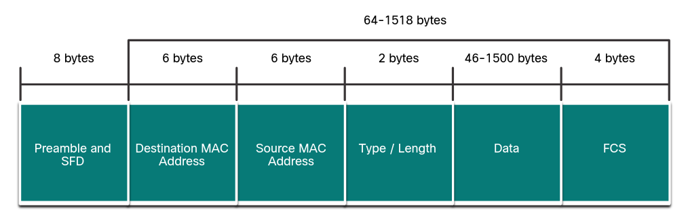
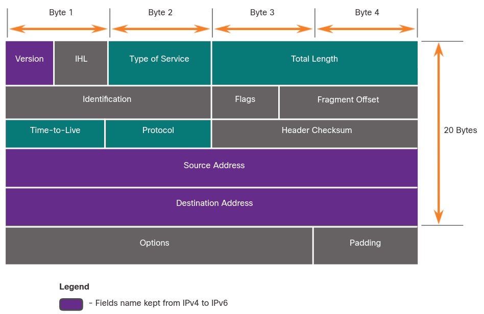
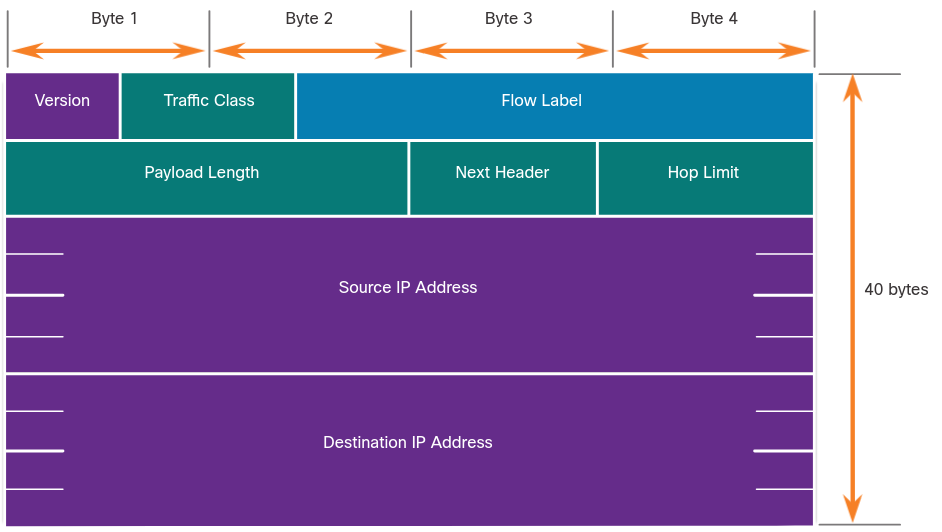
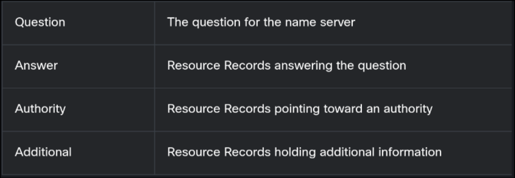
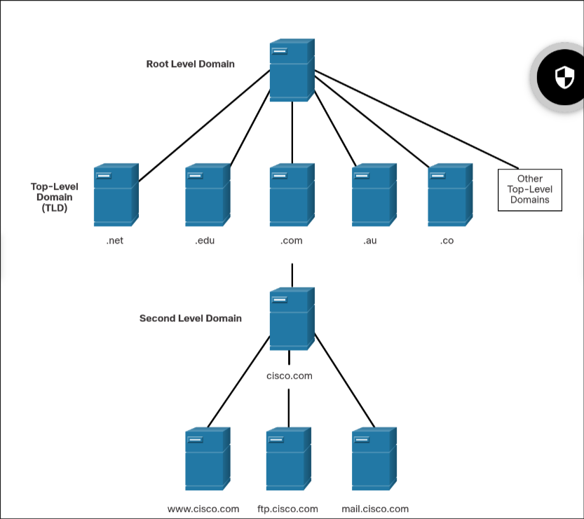
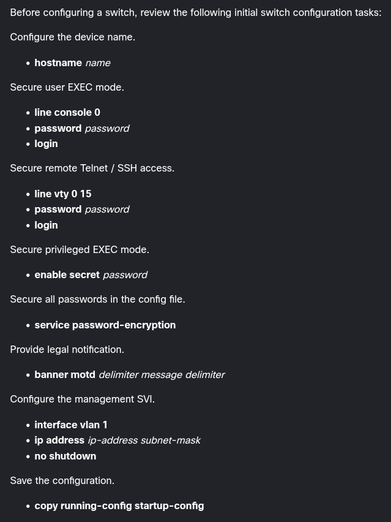

# net design

reliable nets are:

* fault tolerant
* scalable
* QoS
* security

hierarchical model:

1. access layer
2. distribution layer
3. core layer

> Which layer of the hierarchical design model provides a means of connecting devices to the network and controlling which devices are allowed to communicate on the network?

apparently access

# cloud & virtualization

SaaS, PaaS, IaaS

pub, priv, hybrid, community clouds

server sprawl: when servers go underused

> The hypervisor is a program, firmware, or hardware that adds an abstraction layer on top of the physical hardware. The abstraction layer is used to create virtual machines (...)

type 1 (bare-metal) and 2 (hosted) hypervisors

# number systems

lol

ipv4 uses **dotted decimal** syntax

# ethernet switching

ethernet, along with WLAN, are the most used LAN technologies

LLC / MAC sublayers

* LLC sublayer: controls the network interface through software drivers. places info in the frame that identifies which network layer protocol is being used
* MAC sublayer: hardware circuitry part, encapsulates the frame with info

## frames

frames are 64 - 1518 bytes expected (not counting preamble)
* data: 46 - 1500



data might need padding to get to the min 64 bits

if frame < 64 bits (runt frames) or > max, it gets dropped

## MACs

6 bytes, first 3 are manufacturer (OUI), last 3 is NIC identifier

* unicast
* broadcast (FF....FF)
* multicast
	- (01-00-5E-XX-XX-XX when data is IPv4, 33-33-XX-XX-XX-XX when it's IPv6)
	- there are other for when the data is not IP
	- 224.0.0.0 to 239.255.255.255
	- ff00::/8
	- flooded by switches, not forwarded by router unless configured
	
## switches

CAM table (MAC address table)

learn & forward

if it doesn't find the MAC, it'll broadcast (unknown unicast)

# network layer

> Network layer protocols perform four operations: addressing end devices, encapsulation, routing, and de-encapsulation.

* ip
* ospf
* icmp

encapsulation (top to bottom) and deencapsulation

ip is:

* connectionless: you don't establish a previous connection before sending a packet, you just send it
* best-effort: no guarantee there aren't lost packets
* media independent: can be used through any cable/medium

maximum transmission unit (MTU) & fragmentation

> The MTU is passed to the network later by the data link layer.

ipv4:



ipv6:




# ipv4 address structure

nothing important lol

# arp

ARP: type 0x806

if no one responds to ARP req => drop packet

ARP table entries have TTLs (in windo, 15-45s)

ICMPv6 Neighbor Discovery

ARP poisoning attack => mitigate with dynamic ARP inspection (DAI)

# dns

FQDN: fully qualified domain name

1. send FQDN in browser
2. send DNS request to designated server
3. DNS answers

## message format

record types

* A: end device IPv4
* AAAA: end device IPv6
* NS: authoritative name server
* MX: mail exchange record
* TXT: text



## hierarchy



# dhcp

DHCP for IPv4 and IPv6 (DHCPv6)

* DHCPv6 doesn't provide default gateway, this is obtained through [ICMPv6 Router Advertisement](http://www.tcpipguide.com/free/t_ICMPv6RouterAdvertisementandRouterSolicitationMess-2.htm)

discover -> offer -> request -> acknowledgement in DHCPv4

solicit -> advertise -> info request -> reply in DHCPv6

# transport layer

we manage **communications**

many responsibilities:

* tracking individual conversations
* segmenting data
* adding header info
* identifying applications
* conversation multiplexing: allow multiple apps to use the network simultaneously

segments ~ datagrams

## tcp

10 fields, 40 bytes

* number segments
* acknowledge data
* retransmit after some time
* sequence/reorder segments
* send data at a rate that the receiver can handle
* **needs to establish a connection**

FTP, HTTP

## udp

4 fields, 8 bytes

* can be processed faster but is less reliable
* doesn't need to establish a connection
* used by VoIP
* used by DNS because the data is minimal; retransmission can be done manually quickly

DNS, DHCP, SNMP, TFTP, VoIP

DNS & SNMP use UDP by default
* DNS uses TCP if response >512 bytes
* SNMP can be configured to use TCP

## port numbers

socket

well-known, registered, private/dynamic

ports open to an app and can't be opened to another app simultaneously

connection establishment:
* SYN
* SYN, ACK
* ACK

connection termination:
* FIN, ACK
* ACK
* FIN, ACK
* ACK

SYN:
* has an initial random sequence number; wireshark makes it relative so that the SYN has SEQ=0

## reliability

[SEQ and ACK numbers](https://www.youtube.com/watch?v=8XJPZttC4RM)

window size: number of bytes that can be sent before an ACK

max segment size (MSS): number of bytes that one segment can have. common is 1460

^ both agreed on three-way handshake

congestion avoidance

## udp communication

low overhead but not reliable

no reordering


# build small cisco :tm: network



```
enable

show running-config
show startup-config

hostname R1
banner motd #this is my message#
service password-encryption

enable secret rootpassword

line console 0
password userpassword
login
exit

line vty 0 4
password sshtelnetpassword
login
transport input ssh telnet
exit
```

```
show ip ssh
ip domain-name mydomain.name
ip ssh version 2
crypto key generate rsa
crypto key zeroize rsa
username myuser secret mypasswd
transport input ssh
login local
```

```
line console 0
ip default-gateway 192.168.10.1
```

# icmp

v4 and v6

destination unreachable

ping

tracert