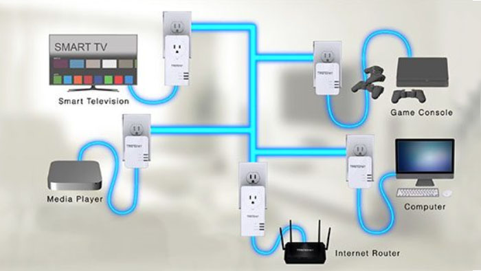
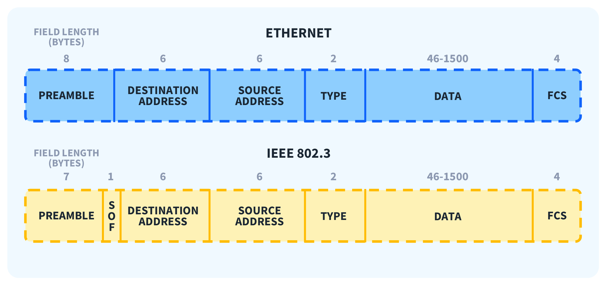
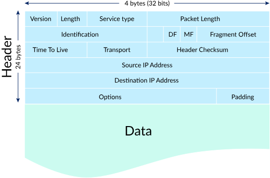
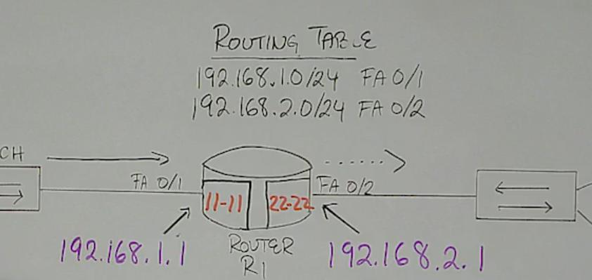
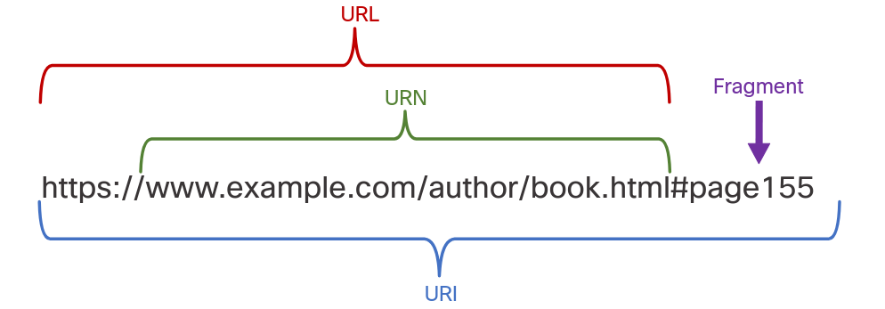

# wired

* powerline

# wireless

* bluetooth
* nfc
* gps
* wifi
* cellular

# layer 2

# ipv4

unicast: end to end, 1.1.1.1 to 223.255.255.255

multicast: 224.0.0.0 to 239.255.255.255
* send "role-based" packets
* you can assign hosts to these "roles" (which are multicast IPs)

experimental: 240.0.0.0 to 255.255.255.254

broadcast 
* limited: 255.255.255.255, for all in the **LAN**, router doesn't forward this
* directed: special router broadcast IP, router forwards this to another network
	- i am in network A
	- send a packet to network B's broadcast IP
	- network B's router sends unicast packets to all its members
	
https://www.practicalnetworking.net/stand-alone/local-broadcast-vs-directed-broadcast/

private IP addrs:
* 10.0.0.0/8
* 172.16.0.0 to 172.31.255.255
* 192.168.0.0/16 

link-local: 169.254.0.0/16, assigned when a host can't get assigned an IP through DHCP

network segmentation: subnetting

# ipv6

how2transition:
* dual stack
* tunneling
* translation

formats
* preferred format
* remove leading zeros
* compressed format (single use of ::)

# DHCP

dynamic host configuration protocol

static addressing: can be done both in the host (by the network admin) or in the router through DHCP reservations

DHCP packets:
* DISCOVER (broad)
* OFFER (uni)
* REQUEST (broad)
* ACK (uni)

Q: can a network have 2+ DHCP servers? if not, how does one prevent that?

# gateways

a way for traffic to leave one local net and be forwarded to remote nets

for a host to speak like this ^ it'll need addr of a **default gateway**

https://blogs.cisco.com/learning/exploring-the-linux-ip-command

common problem: the default gateway is  not from my network!

# NAT

network address translation

private IP <-> public IP

hosts in an internal network share the same single public IP from the router

used when sending messages outside the network

# ARP

remember: switches forward broadcasts, routers don't

first host checks on the ARP table for an IP-MAC correspondence

ARP request (layer 2 frame): whoever has IP XYZ, send me your MAC

# routing

determine the best path to a destination

routers have a routing table: associate a network with the best path to reach those networks

> If the router cannot determine where to forward a message, it will drop it.

you can set a static default route (usually another router) so that it sends all the unknown packets

# transport layer

## UDP

User Datagram Protocol

primarily in straming / communications

doesn't care about dropped packets, doesn't retransmit

packets have: SRC port, DEST port

## TCP

Transport Control Protocol

there's a mechanism that minimizes dropped packets, and retransmits those

packets have: SRC port, DEST port, SEQ num

A sends the packets to B, B sends ACKs once it receives them

> The TCP protocol works between end devices, not between each device on the network. Routers, switches, etc. do not participate in the packet recovery process.

> For each TCP segment (or group of  segments) sent by a host, there is an acknowledgment. If the sender does not receive an acknowledgment within a period of time, the sender resends the segment.

## ports

when we setup a server we put a port it will listen packets from

web browsers pick a source port

# application layer

## uri: urn & url

* DNS (domain name system)
* SSH
* SMTP (simple mail transfer protocol)
* POP (post office protocol)
* IMAP (internet message access protocol)
* DHCP
* HTTP
* FTP

`nslookup` to see what IP does the DNS server resolve a website

* ipconfig (/all, /release, /renew)
* ping (-4,-a,-6,-t,... many options)
* netstat: show active connections
* tracert: shows route taken to a destination
* nslookup: queries DNS