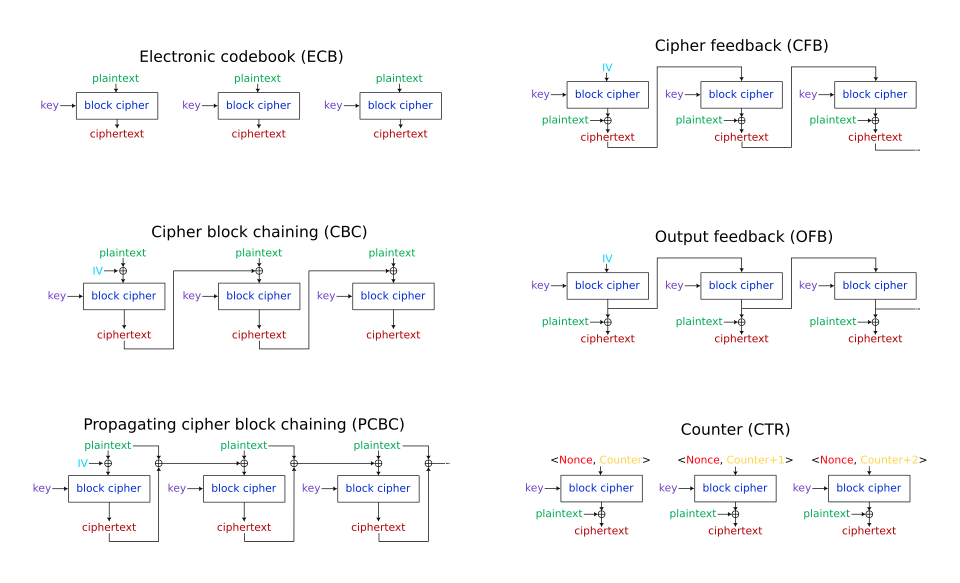
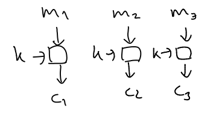
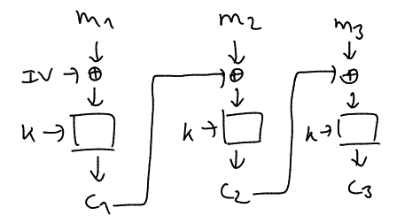
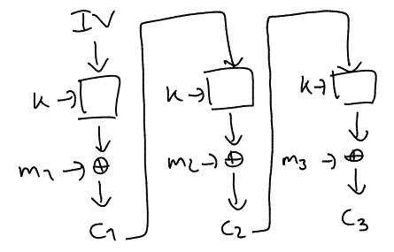
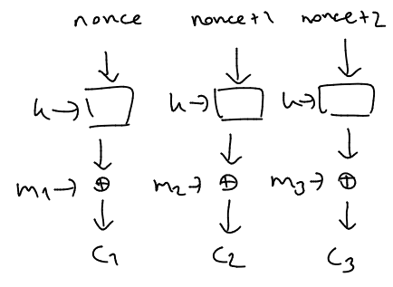
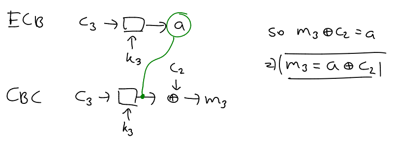

modes of operation
===



ecb:



cbc:



ofb:



ctr:



https://en.wikipedia.org/wiki/Block_cipher_mode_of_operation#/media/File:BlockCipherModesofOperation.svg

ECB oracle can be used to gather the key

```
guess abcdef:

000000000000000?: guessing area
000000000000000a: flag char
bcdef01020304050: flag+padding
```

if i can encrypt with CBC but decrypt with ECB:

